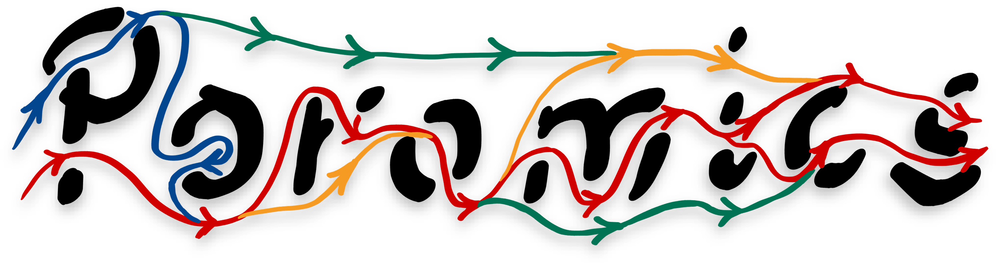
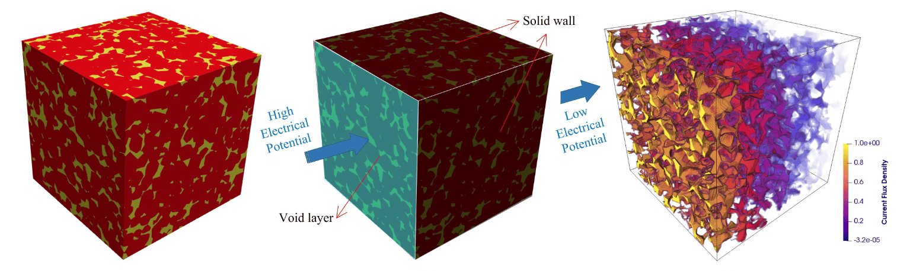

# Poromics documentation

## What is Poromics?

{ width="320px" align=right }

Poromics is an open-source Python package for estimation of transport properties of 2D/3D images of porous materials. The main design philosophies driving Poromics are speed and ease of use. Poromics is developed alongside the Julia library [Tortuosity.jl](https://github.com/ma-sadeghi/Tortuosity.jl/), which serves as its tortuosity simulation engine.

The goal is to support more transport properties in the future such as permeability, transient tortuosity, etc. Poromics is GPU-compatible right out of the box, which can significantly speed up the calculations for large images (up to 50x speedup).

{ width="100%" }
/// caption
A typical workflow for estimating tortuosity. The user loads a 2D/3D image of a porous material and specifies an axis. Poromics then performs a steady-state diffusion simulation along the specified axis to compute the tortuosity from the concentration profile [^1].
///

## Roadmap

- [ ] Add support for more transport properties
    - [x] Diffusional tortuosity
    - [ ] [Electrode tortuosity](https://doi.org/10.1038/s41524-020-00386-4)
    - [ ] Transient tortuosity
    - [ ] Permeability
- [ ] Add command-line interface (CLI) for easy usage
- [ ] Add support for [sysimage](https://julialang.github.io/PackageCompiler.jl/dev/sysimages.html) creation upon installation for faster startup

## Contributing

We welcome contributions to Poromics! If you have any ideas, suggestions, or bug reports, please open an issue or submit a pull request. For more information on how to contribute, please refer to the [contributing guide](contributing.md), or simply open an [issue](https://github.com/ma-sadeghi/poromics/issues) or a pull [request](https://github.com/ma-sadeghi/poromics/pulls) on GitHub.

[^1]: Image from: Fu, J., Thomas, H. R., & Li, C. (2021). [Tortuosity of porous media: Image analysis and physical simulation](https://doi.org/10.1016/j.earscirev.2020.103439). *Earth-Science Reviews*, 212, 103439. (Figure 9)
