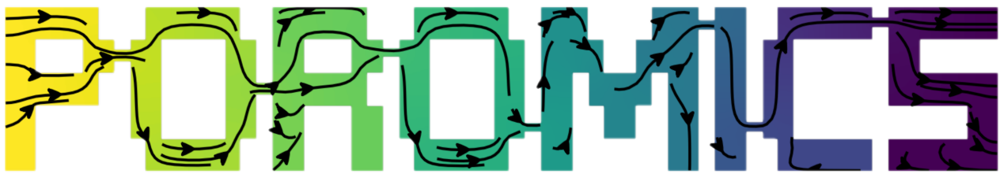
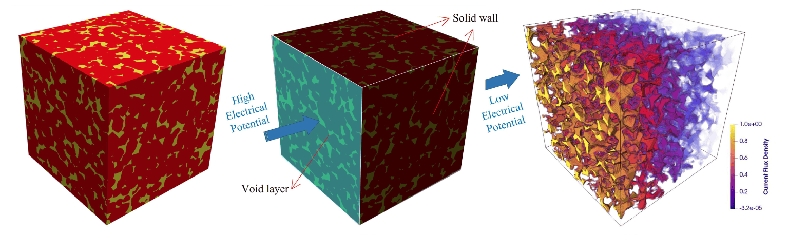

# Poromics

{ width="320px" align=right }

Poromics is an open-source Python package for estimating transport properties from 2D/3D images of porous materials. All solvers are GPU-accelerated: the LBM solvers via [Taichi](https://www.taichi-lang.org/) and the FDM solver via [Tortuosity.jl](https://github.com/ma-sadeghi/Tortuosity.jl/).

**Supported properties:**

- **Tortuosity / effective diffusivity** — via FDM diffusion solver (`tortuosity_fd`) or LBM D3Q7 BGK solver (`tortuosity_lbm`)
- **Absolute permeability** — via LBM D3Q19 MRT solver (`permeability_lbm`)

{ width="100%" }
/// caption
A typical workflow for estimating tortuosity. The user loads a 2D/3D image of a porous material and specifies an axis. Poromics then performs a steady-state diffusion simulation along the specified axis to compute the tortuosity from the concentration profile [^1].
///

## Links

- [Roadmap](roadmap.md) — planned and completed features
- [Acknowledgments](acknowledgments.md) — credits and attributions
- [Contributing](contributing.md) — how to get involved

[^1]: Image from: Fu, J., Thomas, H. R., & Li, C. (2021). [Tortuosity of porous media: Image analysis and physical simulation](https://doi.org/10.1016/j.earscirev.2020.103439). *Earth-Science Reviews*, 212, 103439. (Figure 9)
